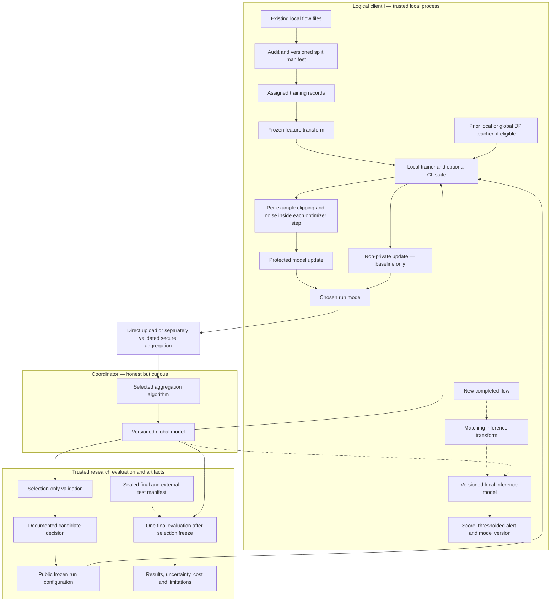

# Architecture A0 — provisional research baseline

Issued 2026-09-08 after the [initial comparative review](../../reports/CP0-comparative-review.md). Category: CURRENT DESIGN DECISION / PROVISIONAL. A0 is a set of interfaces and testable candidates; it is not the final system. EXP-001/EXP-002 implement and validate the audit and [S1 membership contracts](../CP3-split-protocol-S1.md). CP4 follow-up RUN-002-P1 implements five fitted development preprocessing artifacts; see [P1](../CP4-preprocessing-P1.md). CP5 / EXP-003 implements 16 centralized CPU pilot runs and the pre-score CIC P2 precision amendment; see [B1 results](../../reports/CP5-baseline-results.md). This supports feasibility only. Final feature/model/FL selection remains in progress. F1 implements a non-private federated pilot; DP and CL algorithms remain unimplemented.

## Objective and boundary

CP9 implementation note (2026-09-10): F1 completes 28 single-seed run records with matched example exposure and fresh central/local controls. All 240 parameter averages and final predictions verify; 5/12 scenarios meet the exploratory collaboration signal. FedAvg with client Adam remains a comparison reference, not a final winner. Strong heterogeneity can produce pooled and client regressions; local-update drift is a CP10 hypothesis requiring controlled challengers and seed checks. The simulator, shared preprocessing and stored updates provide no DP, secure-aggregation or deployment-isolation guarantee. See [F1 evidence](../../reports/CP9-federated-results.md) and DEC-027/DEC-028.

CP8 implementation note (2026-09-10): N1 adds verified Torch CPU/CUDA prediction migration, native-Adam gradient/update tests and 24 fixed stability fits. All four namespaces have an eligible pilot candidate: learning rate 0.001 for each primary scope, 0.0003 for each stress scope, selected independently with the same 64/32 architecture. See [N1 evidence](../../reports/CP8-neural-results.md) and DEC-024 through DEC-026. This implements the neural candidate within A0; the final detector and FL/DP/CL stack remain provisional. CP9 must specify comparable central/local/federated budgets on C1.

CP7 implementation note (2026-09-10): C1 implements twelve five-client ownership manifests on fixed S1 development matrices. Three scenarios use the registered uniform-mixture fallback, explicitly labeled. H1's four fixed host-separation candidates fail support; all NF attacks occupy one endpoint component. Work proceeds as a non-private synthetic-client study, not independent-host or institutional evidence. Neural migration/stability precedes central/local/FL trials. See [CP7 evidence](../../reports/CP7-host-client-results.md). Private and CL-specific client contracts remain pending.

CP6 implementation note (2026-09-09): B2 adds 36 verified representation/sensitivity fits and grouped-permutation/endpoint diagnostics. The classical reference remains Extra Trees; the compact MLP remains an integration candidate with measured CIC seed instability. Per-namespace representations are selected for development only. Reduced features fail current S1 gates, and NF validation shares training endpoint pairs almost entirely. Host-aware split feasibility and client contracts precede FL comparisons. See [CP6 evidence](../../reports/CP6-comparison-results.md); no final detector or integration stack is frozen.

Test whether logical institutions can improve flow-based detection through collaboration while controlling record-level disclosure and forgetting. The evidence must separate detection quality, privacy guarantee, retention and cost. General IDS benchmarks support a financial deployment scenario, not a bank-data or production claim.

The baseline runs on one laptop, sequentially simulating clients. It uses previously downloaded flow CSVs. Live packet capture, flow extraction, real institutions, authenticated distributed deployment and secure hardware are not implemented. Raw files stay in their existing dataset directory; generated manifests and later derived artifacts belong in the project workspace.

## Diagram specification

Solid arrows show training/control data; dotted arrows show inference. The evaluation harness is a trusted research component, separate from the coordinator's allowed observation. It must not feed final-test results back into selection.

The privacy node is an operation inside training, not noise added once after arbitrary non-private local training. The non-private and protected paths are alternative experiment modes; they must never both release updates from the same private training execution. Replay/EWC/teacher state lives at clients. Secure aggregation is an optional separately tested protocol, not a label for ordinary averaging. Evaluation releases involving protected records need their own privacy treatment; the depicted standard metrics use public evaluation records.

## Component contracts

| Block | Input → processing → output | Stored artifact | Assumptions, failure points and alternatives |
|---|---|---|---|
| Source adapter | Existing CSV → chunked parsing with positional column identities → typed chunks and provenance | File hashes, schema, parser settings, rejected-row report | Never edit source files. Duplicate trimmed names or malformed rows can silently corrupt features; fail visibly. Alternative: verified extraction from authorized PCAP later |
| Audit | Chunks → quality/label/time/duplicate checks → dataset eligibility | Audit JSON/Markdown, per-file statistics | Audit is data-dependent and outside proposed DP curation boundary; it must not be represented as private preprocessing. Alternative: predeclared public curation or budgeted private audit |
| Split builder | Provenance and grouping metadata → locked group/time/client assignments → row IDs for train/validation/test | Split version, cutoffs, seeds, content hashes, overlap assertions | Label/day confounding, duplicates and absent metadata can invalidate generalization. Alternative: explicitly weaker grouped split with narrower claim |
| Feature transform | Training/public-reference records → fixed semantic exclusions, imputation/scaling/encoding → model inputs | Feature list, units, fitted transformer and hash | No fit on selection/final test. Metadata used for splitting must not become a predictor by accident. Privacy path uses public/fixed transform or accounted private fit |
| Feature comparison | Allowed training and validation → full eligible versus train-selected features → selected candidate | Ranking, selector fit scope, feature-version decision | Avoid selecting on final domains. Alternative: no learned selection when complexity gives no benefit |
| Local model | Feature vector → LR/tree/MLP prediction → probabilities/scores | Model state, class order, calibration, size | NaNs, missing classes, wrong schema and uncalibrated scores. Trees are comparators, not averaged neural weights |
| Client simulator | Partition manifest and global model → bounded local training → versioned update | Client assignment, participation seed, step count, local state | Fixed sample-weighting may reveal counts; private confirmatory runs use public fixed weights. Sequential wall time does not estimate parallel deployment |
| CL adapter | Current task plus eligible prior state → loss/state update → local model and retained state | Task version, buffer or teacher/importance state, bytes | State ownership and new-client initialization must be explicit. Alternatives: frozen, naive, ER, EWC, LwF; only eligible variants enter DP integration |
| Privacy adapter | Per-record loss gradients → norm clipping, Gaussian noise, audited sampling → protected optimizer trajectory/update | Public configuration, accountant state, release ledger | No private pretraining, unaccounted teachers, hidden batch coupling or epsilon resets. Stop before budget overrun. Alternative: non-private result labeled as such; never silently disable DP |
| Transport/aggregation | Compatible updates → selected FedAvg/Prox/FedAdam server rule → global state | Round log, model hash, actual serialized byte counts | Reject stale/mismatched schema and nonfinite updates. Optional cryptographic protocol needs thresholds and dropout tests. Poisoning robustness is outside scope |
| Validation/selection | Public development records and candidate models → fixed metrics/rule → recorded choice | Candidate scores, tuning ledger, decision ID | Multiple comparisons and threshold selection must be reported; never select using final test. Private selection requires separate accounting |
| Final evaluation | Frozen configuration and sealed manifests → one complete protocol run → immutable results | Predictions with restricted access, aggregate tables, cost logs, environment and commit | No post-test tuning. Failures require documented invalidation/rerun, not cherry-picking |
| Inference/alerts | New compatible completed flow → transform, score, threshold → alert record | Model/schema versions, score, timestamp when available | No response automation. Reject incompatible schema; score is not attack proof. Monitor drift and alert volume, without claiming a deployed monitor |

## Initial candidate configuration

Two independent feature tracks: CICFlowMeter for CIC-IDS2017 and semantically audited NetFlow for v3. Identifiers, labels and timestamps are split/analysis metadata by default. Port/protocol information receives a documented sensitivity/shortcut ablation; it is not automatically discarded or retained. No final feature count exists yet.

Classical candidates: logistic regression, Extra Trees, and one boosting challenger if the pilot budget supports it. Random Forest is a reserve comparison. Neural starting candidate: MLP with widths 64 and 32, ReLU, no batch normalization; exact input/output width follows the audited task. Its simplicity enables a controlled FL/DP/CL comparison. If trees win strongly, report that openly; a federated neural integration can still investigate collaboration trade-offs but must not be called the strongest detector.

FL: FedAvg reference, FedProx and FedAdam challengers. Start with five logical clients and full participation, then controlled heterogeneity/partial participation. Five is an engineering pilot choice, not a claim about an ideal banking consortium. Normalize and record the objective weights consistently across comparisons.

CL: frozen, naive, reservoir ER, EWC and LwF comparisons. Use three sequential tasks only if label/time support allows them. A fixed binary head is the primary task; class-incremental multiclass is a separate extension. A new attack family under fixed benign/attack labels is reported as attack-family shift.

Privacy: candidate record-level DP training within clients before upload. The protected dataset is the curated client training table, with add/remove-one-flow adjacency, trusted local processing and an observing coordinator. The accountant must match the implemented sampling and release path. Use a public maximum-step schedule and public fixed client weights. The proposed public-reference/private-population separation must be committed before any privacy-confirmatory run. A guarantee is **not yet established**.

For disjoint fixed clients under valid assumptions, record-level privacy can be reported using the worst affected client's composed budget; do not sum unrelated client budgets by habit. Within a client's repeated rounds/tasks, compose all releases affecting its records. If client assignment, counts, schedules or other released quantities depend on a record, the simple disjoint-client argument may not apply. Avoid claiming amplification from hiding client participation when it is observable.

## Revision triggers

| Finding | Architecture response |
|---|---|
| Local timestamps or labels do not support temporal tasks | Stop temporal claims; use explicitly synthetic ordered tasks or reduce the study, with new split/version |
| Common NF headers mask incompatible features | Reduce to verified semantic intersection or reject cross-domain comparison |
| Classical model substantially exceeds neural model | Preserve strongest detection baseline; revisit neural width/features or narrow the integration claim |
| FedProx/FedAdam gives no stable validation benefit | Retain FedAvg; do not retain complexity because it is fashionable |
| DP compatibility or accounting cannot be justified | Block the private label; keep honest non-private experiments and document the unresolved integration |
| ER wins retention but cannot meet privacy/retention policy | Present separate non-private and eligible private frontiers; do not assert the easy-to-account method is globally best |
| Worst-client/minority performance worsens despite pooled improvement | Revisit objective weighting, features or personalization using development data |
| Runtime exceeds budget | Reduce sample/training grid by predeclared policy, record the change, preserve final-test integrity |

Every architecture revision must record problem, hypothesis, comparison, acceptance rule, result, decision and architecture version. A0 now has component-level data and centralized-model evidence; the integrated FL/DP/CL system remains unvalidated.

## Historical CP8 preparation status (2026-09-10; superseded by completion above)

N1 freezes a prediction-migration gate and bounded native-Adam stability comparison. Four saved-model NumPy layout checks pass, but the Torch converter is unexecuted and the fresh-training runner remains outstanding. Package installation awaits explicit download approval following automatic-review rejection. No runtime, FL, privacy or CL capability is promoted by these preparation results. See DEC-024 and reports/CP8-preparation-status.md.
